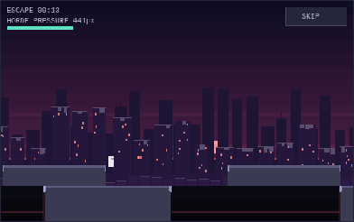
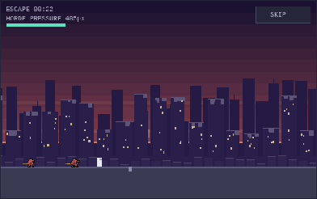
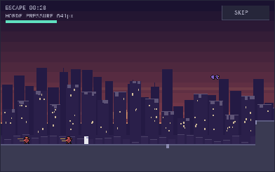
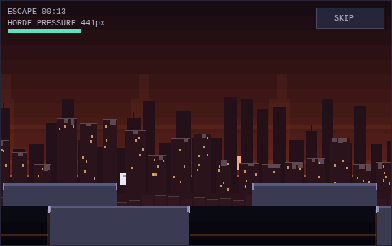
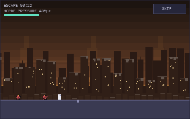
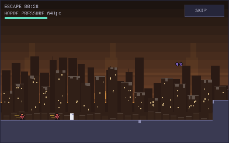
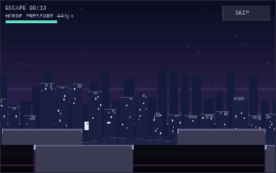
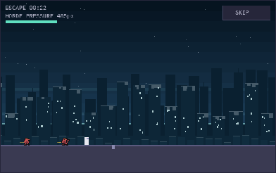
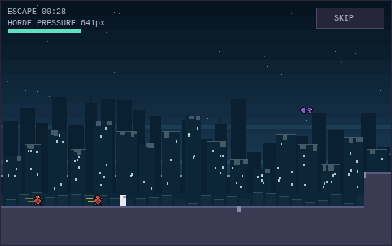
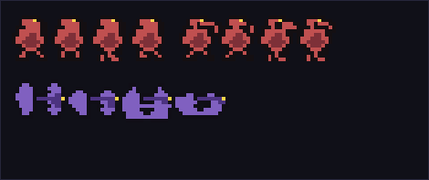

# ESCAPE ART PASS — 2026-09-17 (task msg_01M2QVHA38EEPYNNR0EDYNAH5K)

Three rendered variants of the twilight/dusk metropolis-ruins direction, driven by the REAL
escape sim (same `step` + `inputFor` autopilot the AUTO pilot uses), photographed in real
headless Chromium at a 390x844 phone viewport. **Nothing here touches the game**: the pass
lives entirely in `docs/art/` and imports `src/escape/*` read-only. No scroll speed, corridor
length, step count, payout, timing or latency constant is read or changed — it only draws.

## The three lines (owner picks ONE; winner is NOT built)

- **VARIANT A — SKYLINE EMBER**: indigo dusk / burnt-orange horizon — silhouetted towers, amber windows, embers on the wind.
- **VARIANT B — SMOKE INFERNO**: choked amber-red dusk — near-black skyline, ember windows, thick haze, drifting light shafts.
- **VARIANT C — COLD GRID**: blue-violet twilight — steel skyline, pale-cyan windows, thin haze, stars out above the ruin.

Each family carries FOUR act palettes; the corridor keeps the shipped dusk→dawn travel, but
every family's dawn is tinted in its own temperature (A rose-gold, B ember smog, C cold
steel) so variants stay distinct at every act, including the late-run frames.

## What every variant adds over shipped art (src/escape/render.js)

1. Dusk sky gradient with a lit horizon + a low pixel sun (A/B) or star field (C).
2. THREE parallax ruin bands + foreground debris (shipped: two):
   far 0.18x skyline silhouette · mid 0.45x broken towers WITH LIT WINDOWS and jagged
   broken crowns · near 0.7x rubble · FOREGROUND debris at 1.15x, drawn BELOW the play band
   only (y >= 268) so it never crosses terrain or actors — the readability rule.
3. HAZE: translucent horizontal bands at each layer seam (the depth cue).
4. PER-SCENE render scale (`opts.px`) — a per-canvas `ctx.scale`, NOT a global resolution
   change; the shipped game keeps its own transform. Demoed in the 2x shot below.
5. 4-FRAME actor loops — two NEW intermediate frames per actor (legs crossing, arm sweep
   mid-reach, wings mid-beat), authored in the same integer-pixel grid contract; frames 1+3
   of each loop are the SHIPPED frames, byte-identical (`.slice()` off the real sprites).

## Variant A — SKYLINE EMBER

Mid-run (act 1, t=13) · wall closing (t=22) · final sprint (t=29)

## Variant B — SMOKE INFERNO

## Variant C — COLD GRID

## Per-scene 2x render scale (A, wall closing)

Chunkier pixels, same view — the per-scene scale ask, demonstrated without touching global
resolution:

## Actor sets — 4-frame loops at 2x (run / lunge / flier)

Frames 2+4 are NEW (passing poses between the shipped extremes):

## Verification record

- Real-browser screenshots: Playwright 1.63 headless Chromium, 390x844, `?static=1`
  deterministic freeze; all 11 canvases captured non-black (file sizes 1.9–5.7KB).
- Numeric palette check (canvas `getImageData`), full sky-region averages at the wall-closing
  moment: A `[56,34,59]` violet-dominant · B `[54,37,28]` red-dominant · C `[15,35,51]`
  blue-dominant — the three families read distinctly at EVERY act. (An earlier draft had all
  three families converging on one shared teal dawn at acts 2–3; caught by the same check
  and fixed by authoring per-family dawns.)
- Balance-neutrality by construction: all code in this directory; nothing in `src/` was
  modified for this pass.

## Files

- `variants.mjs` — the pass itself (families, 4-frame sets, `drawScene`, contact sheet).
- `page.html` — the exhibit page (mounts the 9 phone canvases + 2x demo + contact sheet;
  `?static=1` freezes for deterministic screenshots, otherwise the scenes animate live).
- `shots/` — the real-browser screenshots embedded above.

## NOT done (per task scope)

No winner is picked and nothing is wired into the shipped renderer. Next step is the owner's
call: pick a family (or a mix — e.g. A's skyline with C's star field), then a follow-up task
ports the chosen direction into `src/escape/render.js` under the same balance-neutral
constraints.
